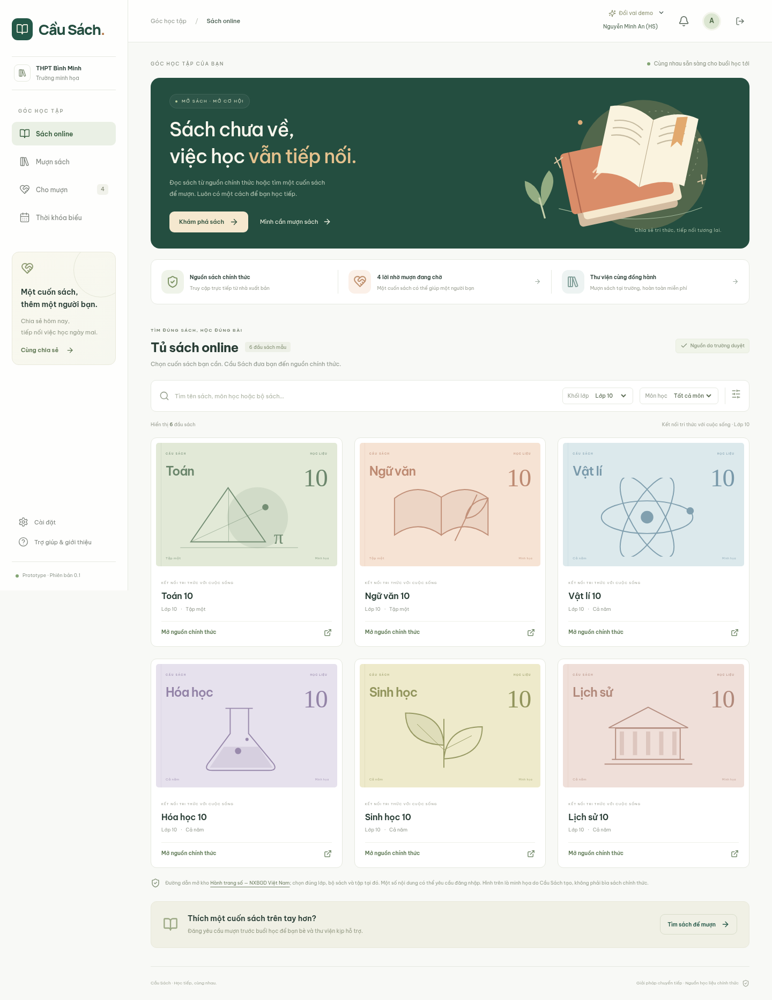

# Cầu Sách — Học tiếp, cùng nhau

Prototype website hỗ trợ học sinh trong thời gian chưa được cung ứng đầy đủ sách giáo khoa: mở nguồn sách chính thức và kết nối mượn sách theo ngày, tiết học.

**Người đề xuất ý tưởng: Nguyễn Xuân Hiếu — lớp KHMT2026.** Ý tưởng và định hướng sản phẩm do Nguyễn Xuân Hiếu đề xuất; mã nguồn và giao diện được AI xây dựng theo yêu cầu của Hiếu. Prototype được giới thiệu tới quý thầy cô và các anh chị trong CLB AI để trình bày ý tưởng và tiếp nhận góp ý.

**Đây là bản demo trên một trình duyệt.** Tài khoản, lịch học, số bản sách và email đều mô phỏng. Không có máy chủ, xác thực thật, thanh toán hoặc email gửi ra ngoài. Chỉ sử dụng dữ liệu giả khi trình diễn.



## Chạy nhanh

Yêu cầu: Node.js 22.18 trở lên (đã chạy với Node 26.8.2), npm, trình duyệt hiện đại.

```bash
cd /home/xhbt/Project
npm ci
npm run dev
```

Mở **http://127.0.0.1:5173/**. Nếu cổng đã được dùng, xem URL mà Vite in ra. Dùng cùng URL trong suốt demo vì `localStorage` tách theo origin (`localhost` và `127.0.0.1` có dữ liệu riêng).

## Cách tải và chạy

Cần cài Node.js 22.18 trở lên cùng npm trước khi chạy. Có thể kiểm tra bằng `node --version` và `npm --version`. Máy cần Internet để tải các thư viện ở lần cài đặt đầu tiên và mở trang sách của nhà xuất bản.

**Cách 1 — Tải ZIP, không cần Git:**

1. Trên trang repository GitHub của dự án, chọn **Code → Download ZIP**.
2. Giải nén vào một thư mục trên máy.
3. Mở terminal ngay trong thư mục đã giải nén, nơi chứa `package.json` và `package-lock.json`.
4. Chạy:

```bash
npm ci
npm run dev
```

**Cách 2 — Clone bằng Git:**

Thay `TEN_GITHUB` và `TEN_REPOSITORY` bằng thông tin repository thực tế (có thể sao chép URL ở nút **Code**). Đây là chỗ giữ tên, không phải địa chỉ dự án đã được xuất bản.

```bash
git clone https://github.com/TEN_GITHUB/TEN_REPOSITORY.git cau-sach
cd cau-sach
npm ci
npm run dev
```

Sau khi terminal hiện dòng `Local`, mở URL đó trong trình duyệt, thường là **http://127.0.0.1:5173/**. Giữ terminal chạy trong lúc dùng thử; nhấn **Ctrl+C** để dừng. Không mở trực tiếp `index.html` bằng cách nhấp đúp vì mã nguồn cần được Vite xử lý.


Nếu cổng đã được dùng, xem URL mà Vite in ra. Dùng cùng URL trong suốt demo vì `localStorage` tách theo origin (`localhost` và `127.0.0.1` có dữ liệu riêng).


Tại màn hình đăng nhập, dùng **`minhan` / `demo2026`** hoặc chọn nhanh một vai demo. Dùng menu **Đổi vai demo** để thử người mượn, người cho mượn và thư viện trên cùng trình duyệt. Mỗi máy có dữ liệu riêng, không đồng bộ yêu cầu với các máy khác.

## Thay đường dẫn trực tiếp tới từng cuốn sách

Danh mục nằm trong **`src/catalog.ts`**. Mỗi đối tượng sách có một trường `url`; nút **Mở nguồn chính thức** trên giao diện dùng đúng giá trị này.

1. Truy cập website chính thức của nhà xuất bản, mở đúng sách, khối lớp, bộ sách và tập.
2. Sao chép đường dẫn trực tiếp của cuốn sách trên thanh địa chỉ. Ưu tiên link chia sẻ chính thức nếu trang cung cấp; không dùng URL chứa token đăng nhập hoặc thông tin phiên cá nhân.
3. Trong `src/catalog.ts`, tìm sách theo `id` hoặc `title`, rồi thay **chỉ giá trị `url`**. Giữ dấu nháy và dấu phẩy, không đổi `id` vì yêu cầu mượn đang tham chiếu tới ID này.

| ID | Cuốn sách |
| --- | --- |
| `math10` | Toán 10, tập một |
| `lit10` | Ngữ văn 10, tập một |
| `physics10` | Vật lí 10 |
| `chem10` | Hóa học 10 |
| `bio10` | Sinh học 10 |
| `history10` | Lịch sử 10 |

Ví dụ phần cần sửa trong đối tượng `math10`:

```ts
// Trước:
url: 'https://hanhtrangso.nxbgd.vn/',

// Sau: thay chuỗi bên dưới bằng URL thật vừa sao chép.
url: 'DAN_DUONG_DAN_CHINH_THUC_CUA_SACH_TOAN_10_VAO_DAY',
```

4. Lưu file. Nếu đang chạy `npm run dev`, giao diện cập nhật tự động. Bấm nút trên thẻ sách để kiểm tra mở đúng cuốn; thử thêm cửa sổ ẩn danh để biết người xem có cần đăng nhập phía nhà xuất bản không.
5. Nếu nhà xuất bản không có link riêng ổn định, giữ link kho sách và hướng dẫn chọn sách tại đó. Không tải sách về rồi đăng lại để thay thế đường dẫn.
6. Khi thay được link trực tiếp, cập nhật chú thích `.source-footnote` trong `src/pages/BooksPage.tsx` và phần mô tả nguồn trong README cho đúng tình trạng thực tế. Nếu chỉ một số cuốn có link riêng, ghi rõ các cuốn còn lại vẫn mở kho chung. Khi đổi nhà cung cấp, cập nhật thêm trường `source` của sách.
7. Nếu web đã được triển khai lên mạng, cần build/deploy lại hoặc push thay đổi để nền tảng hosting tự cập nhật. Sửa file trên máy không tự thay đổi bản web công khai.

## Tài khoản demo

**Mật khẩu chung: `demo2026`.** Có thể chọn trực tiếp một vai trên màn hình đăng nhập hoặc dùng menu **Đổi vai demo** góc trên khi đã đăng nhập.

| Tên đăng nhập | Vai | Dùng để demo |
| --- | --- | --- |
| `minhan` | Nguyễn Minh An, lớp 10A1 | Người mượn, xem và xác nhận đề nghị |
| `khanhlinh` | Trần Khánh Linh, lớp 10A2 | Có Toán 10, không học Toán tiết 1–2 nên nhận gợi ý |
| `quanghuy` | Lê Quang Huy, lớp 10A3 | Có Toán 10 nhưng học Toán tiết 1–2; vẫn xem bảng và chủ động đề nghị |
| `hamy` | Phạm Hà My, khách | Mượn/cho mượn cộng đồng, không có lịch học hoặc thư viện |
| `thuvien` | Thư viện | Nhận yêu cầu riêng, kiểm tra số bản, đề nghị hoặc từ chối |

Tài khoản khách mới cũng dùng mật khẩu demo chung. Không thu thập hoặc lưu mật khẩu riêng. Các tên người và trường THPT Bình Minh là dữ liệu minh họa.

Ngày mượn mẫu tự đặt vào ngày học tiếp theo, bỏ qua cuối tuần. Lịch mẫu chỉ có thứ Hai–thứ Sáu, 8 tiết/ngày, giờ Việt Nam.

## Những gì đã hoạt động
- Danh mục 6 sách lớp 10, tìm kiếm tiếng Việt có/không dấu, lọc môn và mở nguồn chính thức ở tab mới.
- Tạo yêu cầu theo ngày, từ tiết/đến tiết; lựa chọn cộng đồng hoặc thư viện.
- Bảng yêu cầu cộng đồng cho cả học sinh và khách; bộ lọc sách/ngày/tiết.
- Khai báo “Sách mình có”. Mỗi sách cá nhân tương ứng một bản; thư viện có số bản mẫu.
- Gợi ý cho học sinh có đúng sách, không học môn đó trong khoảng mượn và sách còn khả dụng.
- Đề nghị → người mượn xác nhận một đề nghị → nhận sách → người cho mượn xác nhận trả.
- Địa điểm nhận/trả, phí 10.000đ/lượt cá nhân, thư viện miễn phí, thanh toán trực tiếp.
- Chặn giữ cùng một bản sách cho các lượt trùng thời gian; kiểm tra lại ngay khi xác nhận.
- Tự ẩn yêu cầu mở đã hết hạn, giữ lịch sử; sách đã xác nhận chưa trả hiển thị quá hạn.
- Thông báo trong ứng dụng cho cả khách và học sinh; tùy chọn email và hộp thư mô phỏng.
- Lưu dữ liệu trình duyệt; nút khôi phục demo có xác nhận trước khi xóa dữ liệu tự tạo.
- Giao diện điện thoại, bảng thời khóa biểu cuộn ngang trong khung, modal hỗ trợ bàn phím.

## Những gì được mô phỏng hoặc chưa kết nối

| Thành phần | Hiện tại | Bản triển khai thật cần thêm |
| --- | --- | --- |
| Tài khoản | Chọn vai, mật khẩu chung | Nhà trường cấp, xác thực phía máy chủ |
| Dữ liệu học sinh/lịch | Dữ liệu mẫu trong `src/seed.ts` | Nhập và kiểm tra dữ liệu từ trường |
| Danh mục sách | 6 đầu sách lớp 10, một bộ sách | Trường duyệt sách/tập/phiên bản và đường dẫn |
| Đọc sách | Mở **kho Hành trang số**, chọn sách tại đó | Xác minh và bổ sung deep link đúng từng cuốn khi có |
| Thông báo | Khi người dùng đang xem demo | Đồng bộ phía máy chủ, tác vụ nền và email thật |
| Email | Nhật ký thư theo từng người | Dịch vụ gửi email, xác minh địa chỉ, cơ chế hủy đăng ký |
| Lưu trữ | `localStorage`, cùng một trình duyệt | Cơ sở dữ liệu dùng chung và xử lý tranh chấp đồng thời |
| Thư viện | Số bản tổng cố định trong seed | Quản lý bản sách, giao nhận, cập nhật tồn kho thực tế |

**Không dùng thử nghiệm này với thông tin học sinh thật.** Ai dùng công cụ phát triển trình duyệt cũng có thể đọc/sửa dữ liệu demo và đổi vai. Nhiều tab cùng ghi chưa được đồng bộ. Không dùng như một hệ thống xác thực hoặc phân quyền sản xuất.

Fonts lấy từ Google Fonts nếu có mạng, với font hệ thống dự phòng. Nội dung sách chỉ có tại nguồn bên ngoài và cần Internet; website không cung cấp bản sách ngoại tuyến.

## Quy trình mượn quan trọng

1. Chọn **cộng đồng**: yêu cầu công khai trong trường demo. Chọn **thư viện**: chỉ người mượn và vai thư viện nhìn thấy.
2. Chỉ thông báo gợi ý dùng thời khóa biểu. Người bận tiết vẫn có thể chủ động đề nghị; hệ thống không quyết định thay họ.
3. Một đề nghị chưa giữ sách. Người mượn phải xác nhận; khi đó yêu cầu rời bảng và các đề nghị khác đóng.
4. Khoảng mượn tính cả tiết đầu và tiết cuối. Giờ bắt đầu/kết thúc tra bảng chuông, dùng múi giờ `Asia/Ho_Chi_Minh`.
5. Khi hết tiết cuối, chỉ yêu cầu **đang mở** tự hết hạn. Không tự xác nhận đã trả sách.
6. Lượt đã nhận chỉ người cho mượn xác nhận đã nhận lại sách. Bản sách quá hạn chưa trả không được giữ cho yêu cầu mới.
7. Hủy trước lúc nhận sách, có thể chọn “Đã có sách chính thức”. Lịch sử vẫn được lưu.

## Kiểm tra giao diện

Trong một terminal chạy `npm run dev`. Terminal khác:

```bash
npm run test:browser
```

Bộ kiểm tra dùng Chromium `/usr/bin/chromium`. Nếu ở máy khác:

```bash
CHROMIUM_PATH=/duong/dan/toi/chromium npm run test:browser
```

Có thể đặt `TEST_URL` nếu server dùng cổng khác. Playwright mở profile kiểm thử mới, không điều khiển trình duyệt cá nhân. Ảnh kết quả ở `docs/screenshots/`. Các kiểm tra domain và browser đều đã chạy thành công; chi tiết tại [kiểm tra và giới hạn](docs/TESTING.md).


## Nguồn và nguyên tắc nội dung

- Đường dẫn sách: [Hành trang số — Nhà xuất bản Giáo dục Việt Nam](https://hanhtrangso.nxbgd.vn/). Danh mục hiện liên kết tới trang kho sách, chưa phải trang đọc từng cuốn. Giao diện đã ghi rõ điều này.
- Minh họa sách và hero là SVG tự dựng trong mã nguồn; không sao chép bìa hoặc nội dung SGK. Icon từ `lucide-react` (ISC).
- Không upload PDF, scan, tải lại hoặc phát tán nội dung sách. Ghi nguồn không tự tạo ra quyền sao chép.
- Khi áp dụng thật, nhà trường cần duyệt quy trình và mức phí cá nhân, đồng thời rà soát quyền sử dụng/chia sẻ tài liệu. Prototype không khẳng định mọi hình thức cho mượn có thu phí đều mặc nhiên hợp pháp.
- Tài liệu pháp lý tham khảo: [Luật Sở hữu trí tuệ, VBHN 155/2025](https://datafiles.chinhphu.vn/cpp/files/vbpq/2025/9/155-vbhn-vpqh.pdf). Cần kiểm tra văn bản hiện hành khi đưa vào sử dụng thực tế.

Mục tiêu là hỗ trợ chuyển tiếp. Khi nguồn sách chính thức đủ, học sinh đóng yêu cầu đang mở và hoàn trả các sách đã mượn.
