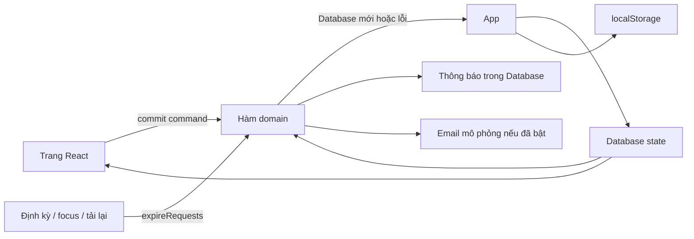

# Kiến trúc và bản đồ mã nguồn

## Tổng quan

Ứng dụng SPA không có routing URL, không máy chủ. Trang hiện tại nằm trong React state; tải lại trang quay về Sách online. Tài khoản đăng nhập và dữ liệu demo được giữ trong `localStorage`.

```text
Project/
├── AGENTS.md              # Quy tắc cho agent tiếp tục
├── README.md              # Chạy thử, tài khoản, phạm vi
├── package.json           # Lệnh và dependency
├── package-lock.json      # Khóa dependency để npm ci tái lập
├── index.html             # Entry HTML, metadata, favicon SVG
├── tsconfig.json          # TypeScript strict
├── src/
│   ├── main.tsx           # Mount React và CSS
│   ├── App.tsx            # Database state, đăng nhập, shell, điều hướng, tour
│   ├── context.ts         # db/user/commit/go và thao tác cấp ứng dụng
│   ├── types.ts           # Kiểu dữ liệu nghiệp vụ
│   ├── catalog.ts         # Danh mục sách và nguồn chính thức
│   ├── seed.ts            # Tài khoản/lịch/sách/yêu cầu mẫu
│   ├── domain.ts          # Toàn bộ lệnh nghiệp vụ và kiểm tra điều kiện
│   ├── storage.ts         # Khóa storage, khởi tạo/fallback dữ liệu
│   ├── AuthorWelcome.tsx  # Lời chào tác giả, tải README qua Vite asset URL
│   ├── vite-env.d.ts      # Kiểu TypeScript cho Vite và import ?url
│   ├── components.tsx     # Modal, giới thiệu, tour, minh họa SVG
│   ├── styles.css         # Desktop/mobile, modal, tour, reduced motion
│   └── pages/
│       ├── BooksPage.tsx  # Tra cứu, nguồn chính thức
│       ├── LoansPage.tsx  # Mượn, cho mượn, form và card yêu cầu
│       └── UtilityPages.tsx # Lịch học, thông báo/email, cài đặt
├── tests/
│   ├── domain.test.ts     # Nghiệp vụ, quyền, lịch, kho sách, trạng thái
│   └── browser.mjs        # Luồng thực trên Chromium, chụp ảnh
└── docs/
    ├── ARCHITECTURE.md    # File này
    ├── SPEC.md            # Màn hình và quy tắc sản phẩm
    ├── DEMO.md            # Kịch bản demo/thuyết trình
    ├── TESTING.md         # Kết quả và cách kiểm tra
    └── screenshots/       # Ảnh minh chứng do test browser tạo
```

`dist/`, `node_modules/`, `*.tsbuildinfo` là đầu ra hoặc dependency, được bỏ qua trong Git.

## Luồng dữ liệu



- `commit` bắt lỗi và hiện toast tiếng Việt. Không thay đổi state khi một lệnh thất bại.
- `domain.ts` dùng `structuredClone`; kiểm tra lại người thực hiện, trạng thái, tồn sách, lịch.
- `expireRequests` chạy khi load dữ liệu, trước mỗi lệnh liên quan, mỗi 15 giây và khi quay lại tab.
- Nếu trình duyệt chặn storage, ứng dụng vẫn chạy trong bộ nhớ và có thông báo dữ liệu có thể mất khi tải lại.
- `storage.ts` kiểm tra cấu trúc ở mức cơ bản/version, chưa có schema validation hoặc migration đầy đủ. Dữ liệu hỏng nghiêm trọng có thể cần xóa khóa demo để khởi tạo lại.

## Dữ liệu

| Kiểu | Trường chính | Quy ước |
| --- | --- | --- |
| `User` | id, name, username, role, classroom, email, emailEnabled, owned, schedule | Không có mật khẩu thật; role student/guest/library |
| `Book` | id, title, subject, grade, series, volume, url, source | catalog tĩnh, minh họa gốc riêng |
| `BorrowRequest` | borrowerId, bookId, date, start, end, target, status, offerId, note | start/end là số tiết 1–8, date YYYY-MM-DD |
| `Offer` | requestId, lenderId, location, status | pending/accepted/closed |
| `Notice` | userId, title, body, kind, requestId, createdAt, read | suggestion hoặc transaction |
| `Mail` | userId, to, title, body, createdAt | Bản ghi thư giả, không có network call |
| `Database` | version, users, requests, offers, notices, mails, stock | Version hiện tại là 1; stock: bookId → số bản tổng |

`owned` là một tập bookId của cá nhân, mỗi bookId tương ứng một bản. Thư viện dùng `stock`. Chưa có mã vạch hoặc tình trạng vật lý cho từng bản.

Khóa `localStorage`:

| Khóa | Ý nghĩa |
| --- | --- |
| `cau-sach:v1` | Toàn bộ Database của trình duyệt |
| `cau-sach:session` | ID vai đang xem |
| `cau-sach:intro` | Đã xem popup giới thiệu |
| `cau-sach:tour:<userId>` | Đã xem/bỏ qua hướng dẫn của tài khoản |

Lời chào tác giả dùng React state, hiển thị mỗi lần tải trang và không lưu cờ ẩn. `README.md?url` được Vite đưa vào bản build để nút tải luôn dùng đúng README hiện tại, kể cả khi hosting ở thư mục con. Giới thiệu và tour chờ đóng lời chào để tránh các lớp hướng dẫn chồng nhau.

Nút reset khôi phục Database và đăng nhập Minh An, không bắt xem lại popup/tour. Có nút mở lại hướng dẫn trong Cài đặt.

## Các lệnh nghiệp vụ

| Hàm | Trách nhiệm |
| --- | --- |
| `createRequest(db, actor, input, now?)` | Kiểm tra quyền, ngày/tiết/sách; tạo yêu cầu và gợi ý |
| `offerBook(db, actor, requestId, location, now?)` | Kiểm tra kênh, sách khả dụng, không tự cho mình; gửi đề nghị |
| `acceptOffer(db, actor, offerId, now?)` | Người mượn chọn một đề nghị; kiểm tra tồn lại; đóng đối thủ |
| `changeRequest(db, actor, requestId, action, reason?, now?)` | cancel, receive, return, reject với quyền tương ứng |
| `expireRequests(db, now?)` | Hết hạn yêu cầu mở, đóng đề nghị, giữ lịch sử |
| `toggleOwned(db, actor, bookId)` | Khai báo/bỏ sách cá nhân; không bỏ sách có lượt đã xác nhận |
| `saveSettings(db, actor, email, enabled)` | Kiểm tra email và lưu tùy chọn |
| `available(db, lender, request, now?)` | Kiểm tra bản sách khả dụng |
| `matchesSchedule(db, user, request, now?)` | Chọn tài khoản trường nhận gợi ý |

## Quy tắc thời gian và tranh chấp

- `periods` khai báo giờ bắt đầu/kết thúc. Mọi timestamp lịch dùng offset `+07:00`, thứ lấy theo ngày Việt Nam.
- Một yêu cầu mở có thể gửi sau khi tiết đầu bắt đầu nếu tiết cuối chưa hết; UI khuyến khích gửi trước ngày học.
- Hai lượt trùng khi cùng ngày và khoảng tiết giao nhau, tính cả hai đầu. Cùng tiết bàn giao không được coi là rảnh.
- Chỉ trạng thái matched/received giữ sách. Pending offer chưa giữ bản.
- Với cá nhân, một bản không được giữ cho hai lượt trùng nhau. Với thư viện, tổng số lượt giữ trùng nhỏ hơn số bản tổng mới cho phép.
- Lượt matched/received đã quá giờ trả vẫn giữ bản cho đến khi trả hoặc hủy hợp lệ. Sách quá hạn không được tính là rảnh ở ngày khác.
- Trong prototype, UI chạy tuần tự trên một state. Bản thật phải khóa/giao dịch phía máy chủ ở bước xác nhận; kiểm tra phía client không đủ chống hai máy xác nhận cùng lúc.

## Hướng mở rộng đã dự kiến

Giữ nguyên màn hình và quy tắc nghiệp vụ, thay `commit`/storage bằng lớp gọi API. Chuyển kiểm tra quyền và thời gian về server, dùng người dùng từ phiên xác thực thay vì actor do client tự gửi. Lưu lịch chuông, lịch học, sách và bản sách theo trường.

Nhà trường sẽ cần luồng import tài khoản/lịch/danh mục có kiểm tra và xem trước. Prototype hiện chỉ mô tả quy trình này, chưa cung cấp upload CSV.

Email thật cần worker, xác minh người nhận, lưu lựa chọn nhận thư và chống gửi lặp. Expiry phải xử lý phía server khi không có người mở trang. Thay đổi trạng thái và thông báo cần cùng một giao dịch hoặc outbox để tránh mất thông báo.

Phạm vi prototype không bao gồm xử lý tranh chấp mất/hỏng sách, hoàn tiền hoặc phí khác. Không thêm chính sách này vào UI như thể đã được nhà trường đồng ý.
