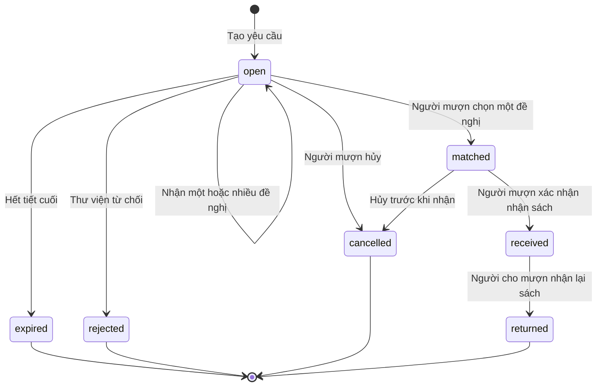

# Đặc tả sản phẩm Cầu Sách

## Mục đích và giới hạn

Giúp học sinh tiếp tục học khi chưa được cung ứng đầy đủ SGK bằng nguồn đọc chính thức và mượn bản sách có sẵn. Khi sách chính thức về, học sinh hủy nhu cầu đang mở và trả sách đã nhận. Không thay thế hệ thống phân phối SGK.

Bản đầu: một trường minh họa, lớp 10, 6 đầu sách, dữ liệu riêng trên trình duyệt. Mô phỏng người dùng và email, không có tài khoản thật hoặc giao dịch thanh toán trực tuyến.

## Màn hình

| Màn hình | Hành vi |
| --- | --- |
| Lời chào tác giả | Hiện mỗi lần mở/tải lại trang; tên Nguyễn Xuân Hiếu, lớp KHMT2026, ý tưởng của Hiếu và mã nguồn/giao diện dựng bằng AI; tải README.md hoặc tiếp tục |
| Giới thiệu | Modal sau lời chào tác giả, chỉ hiện tự động lần đầu: mục tiêu, quyền nguồn sách, trường cung cấp dữ liệu, phí, giới hạn demo/khách |
| Đăng nhập | Username + mật khẩu demo, nút chọn nhanh 5 vai, báo lỗi nhập sai |
| Tạo khách | Tên hiển thị, username duy nhất, checkbox hiểu giới hạn; dùng mật khẩu demo chung |
| Tour | 5 bước: sách → mượn → cho mượn → lịch → thông báo; làm tối nền, spotlight nút, trước/tiếp/bỏ qua |
| Sách online | Trang mặc định; 6 sách, tìm có/không dấu, lọc môn, mở catalog NXB ở tab mới |
| Mượn sách | Yêu cầu của tôi, đang theo dõi/lịch sử, tạo mới, xem đề nghị, xác nhận, nhận sách, hủy |
| Cho mượn | Bảng công khai hoặc bàn thư viện theo vai, lọc sách/ngày/tiết; sách mình có; tôi đã đề nghị/đã xử lý |
| Thời khóa biểu | Bảng tuần theo tài khoản trường; khách/thư viện thấy giải thích và nút quay lại bảng yêu cầu |
| Thông báo | Danh sách riêng của vai hiện tại, chưa đọc, đánh dấu đã đọc, chuyển tới mục liên quan |
| Hộp thư mô phỏng | Bản ghi email được tạo sau lúc bật tùy chọn; không gửi thư thật |
| Cài đặt | Thông tin vai, email, bật/tắt email, giới thiệu, tour, đăng xuất, reset |

Mobile dùng thanh điều hướng dưới; avatar mở Cài đặt. Desktop dùng sidebar. Menu Đổi vai demo có trên cả hai.

## Ma trận quyền

| Hành động | Học sinh | Khách | Thư viện |
| --- | --- | --- | --- |
| Mở nguồn SGK | Có | Có | Có |
| Tạo yêu cầu cộng đồng | Có | Có | Không |
| Gửi yêu cầu thư viện | Có | Không | Không |
| Xem bảng cộng đồng, chủ động đề nghị | Có | Có | UI dùng bàn thư viện riêng |
| Khai báo sách cá nhân | Có | Có | Dùng stock trong seed |
| Có thời khóa biểu | Có | Không | Không |
| Nhận gợi ý dựa trên lịch | Có nếu phù hợp | Không | Không |
| Nhận thông báo giao dịch và email tùy chọn | Có | Có | Có |
| Xử lý yêu cầu riêng của thư viện | Không | Không | Có |

Phân quyền này mô phỏng hành vi ứng dụng, không phải bảo mật. Toàn bộ dữ liệu demo có thể đọc qua localStorage.

## Tạo và phân phối yêu cầu

Chọn sách trong danh mục, ngày mượn, tiết đầu/cuối, kênh gửi và lời nhắn tối đa 240 ký tự. Một lượt là một khoảng tiết trong một ngày, phí cá nhân cố định 10.000đ dù mượn một hay nhiều tiết.

- Ngày cụ thể từ thứ Hai đến thứ Sáu; không lặp lịch hàng tuần.
- Tiết đầu không lớn hơn tiết cuối, số tiết trong 1–8; không tạo lịch đã kết thúc.
- Cộng đồng: mọi học sinh/khách đều thấy, kể cả chủ yêu cầu. Chủ yêu cầu không được tự cho mình mượn.
- Thư viện: chỉ người gửi và vai thư viện xem; không tự đẩy sang cộng đồng khi bị từ chối.
- Gợi ý tự động: tài khoản trường khác người mượn, đã khai báo có đúng bookId, sách còn khả dụng, có lịch ngày đó và không có môn tương ứng trong khoảng tiết.
- Không biết lịch thì không gợi ý. Người không nhận gợi ý vẫn có thể xem bảng và chủ động đề nghị.

Chỉ tạo gợi ý khi tạo yêu cầu. Bổ sung sở hữu sách sau đó chưa tự tạo gợi ý lại. Mở rộng đánh giá lại gợi ý có thể thực hiện ở bản có máy chủ.

## Xác nhận và trả sách

- Người cho mượn nhập địa điểm nhận/trả trong trường. Tài khoản trường điền sẵn lớp, thư viện điền sẵn phòng thư viện, khách tự nhập.
- Mỗi người chỉ gửi một đề nghị cho một yêu cầu. Nhiều người có thể đề nghị cùng lúc.
- Khi người mượn xác nhận: kiểm tra lại sách khả dụng, giữ một bản, đóng các đề nghị còn lại, gửi thông báo hai bên.
- Chỉ người mượn đánh dấu đã nhận. Chỉ người cho mượn đánh dấu đã nhận lại sách; không tự hoàn tất lúc hết giờ.
- Quá hạn là nhãn tính từ giờ trả của matched/received, không phải trạng thái độc lập.
- Thông tin giao nhận được hiển thị cho hai bên khi đã xác nhận; người mượn thấy địa điểm của các đề nghị để lựa chọn.
- Người mượn có thể hủy ở open/matched; lựa chọn lý do gồm đã có sách chính thức, thay đổi lịch, không còn nhu cầu.
- Thư viện được từ chối yêu cầu open, kể cả đã gửi đề nghị nhưng chưa được học sinh xác nhận; thông báo tới học sinh, giữ lịch sử.

## Giá và nội dung

- Cá nhân cho mượn: 10.000đ/lượt, tự thu khi gặp nhau. Prototype chỉ hiển thị thỏa thuận, không theo dõi thanh toán, không có cổng thanh toán hoặc thu hộ.
- Thư viện: miễn phí.
- SGK chỉ mở tại catalog chính thức. Chưa có deep link từng cuốn; thông tin này hiển thị dưới danh mục.
- Không có upload PDF/scan, gửi tài liệu có bản quyền hoặc nút tải SGK.
- Mức phí và quy trình cần trường chấp thuận trước khi áp dụng; việc có thu phí không được tự xem là ngoại lệ bản quyền.

## Thông báo

| Sự kiện | Người nhận trong ứng dụng |
| --- | --- |
| Yêu cầu cộng đồng mới | Học sinh phù hợp sách/lịch |
| Yêu cầu thư viện mới | Thư viện |
| Có đề nghị | Người mượn, bao gồm khách |
| Xác nhận đề nghị | Người mượn + người cho mượn |
| Chọn đề nghị khác | Các người cho mượn chưa được chọn |
| Hủy yêu cầu | Các bên đã đề nghị/được xác nhận |
| Thư viện từ chối | Người mượn |
| Hết hạn yêu cầu mở | Người mượn + bên đã đề nghị |
| Đã nhận sách | Người cho mượn |
| Đã trả sách | Người mượn |

Nếu người nhận đã bật email và có email hợp lệ, tạo thêm bản ghi thư trong hộp thư mô phỏng. Mặc định email tắt. Không gửi bù thông báo cũ, không gửi email thật. Tắt email không tắt thông báo trong ứng dụng.
